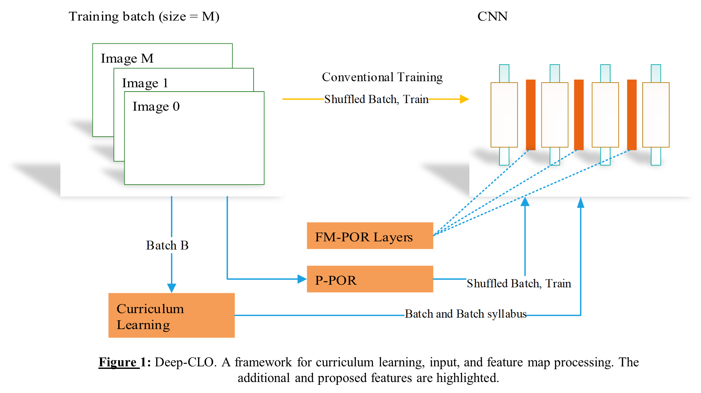

# Deep-CLO : A Framework for Deep Curriculum Learning Optimization and Input Manipulation 

###Abstract 
Convolutional neural networks (CNN) can be trained to extract patterns from datasets that are comprised 
of data which a trained human observer would consider to be noise. These networks are robust at making 
relevant predictions on images with no human-recognizable features. In addition, research has revealed 
that the output of CNNs can be easily altered by adding as small as two-pixel perturbation to the input 
vector. These results indicate that representations learned by CNNs are fundamentally different from that 
of humans. The results also indicate how CNNs use these features to make relevant predictions about 
unsampled input. By leveraging this predictive capability CNNs also permit us to investigate opportunities 
for the development of novel preprocessing techniques and training strategies to further improve CNNs, and
where applicable, to address their shortcomings. In this thesis, I exploit these observations and a unique
view of a digital image where a digital image is modeled as a 2D random variable where a datapoint contained
in the image (such as a pixel) is modelled as an independent and identically distributed random variable
(i.i.d) realization. Adopted from the field of information theory, this view allows us to utilize information
theory techniques to measure some inherent characteristics of a sample and how it relates to other samples 
in the dataset. 

**The framework, Deep-CLO, in the context of deep learning, has three applications:** 

1. **Deep-CLO** – an end-to-end curriculum training in which a batch-based syllabus (ordering of samples by some 
measure) is combined with deep learning to train networks. 
2. **POR** – an algorithm used to preprocess a training sample by proposing image regions (patches) that are then 
analyzed, reorganized, and stitched back together to generate a new training sample. 
3. **FM-POR** – this is like POR except it is implemented as network operation that transforms feature maps. 

### Deep CLO 

### Algorithm POR - Patch proposal, Ordering and new Input Reconstruction 

